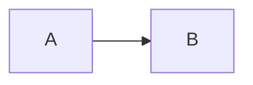
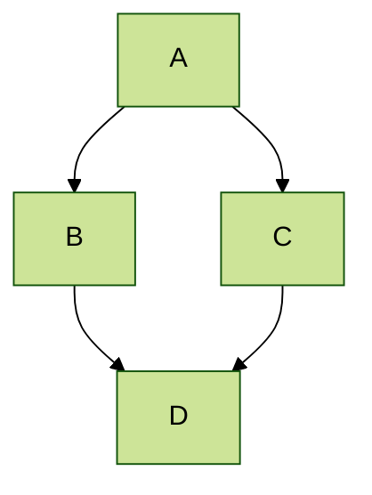

## 流形的概念

我们现在来简洁地介绍一下**流形**的核心概念和理论。总所周知，在微积分中，我们主要研究的是欧几里得空间（例如n维欧几里得空间ℝⁿ）中的函数和曲线。这些空间有一个共同的特点：它们是**平直**的、**全局**的，我们可以为其定义一个统一的坐标系。

然而，自然界和数学中很多重要的对象并不是平直的。例如：
*   **一个球面**（如地球表面）
*   **一个环面**（比如数学家经常用的比喻“甜甜圈”的表面）
*   **一个扭曲的曲面**
*   **更抽象的“形状”或“空间”**

这些对象无法用一个全局的、单一的坐标系来描述，因此就产生了非欧几何，不过这些对象有一个至关重要的共同点：**在任意一个足够小的局部区域里，它们看起来都是平直的，像欧几里得空间的一部分。** 或者用更加拓扑的语言，在局部上，他们 **与某个维度的ℝⁿ** 同胚。

**流形（Manifold）** 的概念就是为了精确地描述这类数学对象。它为我们提供了一个框架，使得我们能够在这些更复杂、更弯曲的空间上做微积分。

作为一个简单的例子，考虑**球面 S²**：例如，我们可以考虑地球表面（在这里我们不妨就认为地球表面就是一个球面），那么在局部上，比如我们将自己看作球面上的一个点，在我们的视野中（局部上），我们就几乎感觉不到球面的弯曲，在我们看来，我们所处的这一小块区域几乎就是一个平面（二维的欧几里得空间ℝ²）。不过如果我们推广我们的视野，那么弯曲就可能出现的，不过单单就我们一般的视野来看，区域还是平直的，这样，我们可以将我们视野中的区域制作一张地图（称为图表），我们知道地图本质上按比例压缩得到的，这是一种连续的变换，此外，我们还需要很多张地图（地图集）才能覆盖全球，这些地图集的总体就称为图册。

这样我们便得到了一个最简单也最基本的流形概念：**n维拓扑流形（Topological Manifold）** M是一个拓扑空间，s.t.：

1.  **豪斯多夫性（Hausdorff）**： 空间中的任意两个不同的点，都存在不相交的邻域将它们分开。。
2.  **第二可数性（Second-countable）**： 它的拓扑有一个可数的基（可数多个开集，任何开集都可以表示为这些开集的并），这保证了流形在某种意义上是“不太大”的，允许我们做积分等操作。
3.  **局部欧几里得性（Locally Euclidean of dimension n）**： 对于M上的**每一点p**，都存在一个**开邻域U**（包含p的一个开集），使得U**同胚于**（homeomorphic to）n维欧几里得空间ℝⁿ的一个开子集。

    *   **“同胚”** 意味着存在一个连续的双射函数 φₚ: Uₚ → ℝⁿ，并且其逆映射也连续。这个函数 φ 被称为一个**图表（Chart）** 或**局部坐标系（Local Coordinate System）**。
    *   因此，图表φ为邻域U上的每个点赋予了一个n维坐标 (x₁, ..., xₙ)。

一个图表(Uₚ, φₚ)只覆盖了流形的一小块区域。为了覆盖整个流形，我们需要一簇图表，一个**图册（Atlas）** 就是一组图表的集合 {(Uᵢ, φᵢ)}，使得这些Uᵢ的并集覆盖了整个流形M。

不过拓扑流形只要求了连续映射的连续性。为了能在上面做微积分，我们需要额外的**光滑结构（Smooth Structure）**：

如果一个流形M上有一个图册使得对于任意两个相交的图表(U, φ)和(V, ϕ)，其**坐标变换（Transition Map）**
    φ ∘ ϕ⁻¹: ϕ(U ∩ V) ⊆ ℝⁿ → φ(U ∩ V) ⊆ ℝⁿ
是一个光滑映射，那么我们称这个图册是一个**光滑图册**，并称M为一个**光滑流形**。

坐标变换描述了在重叠区域，从一个局部坐标系转换到另一个局部坐标系的规则，我们要求这个变换是光滑的，从而保证了在不同坐标系下进行微积分计算时不会产生矛盾，结果是良定的。

## Tips and hints

\(x_1,x_2,x_3\)

* Name a file ".md" to have it render in markdown, name it ".html" to render in HTML.
* Go to the [commit list](https://github.com/academicpages/academicpages.github.io/commits/master) (on your repo) to find the last version GitHub built with Jekyll. 
  * Green check: successful build
  * Orange circle: building
  * Red X: error
  * No icon: not built

* Academic Pages uses [Jekyll Kramdown](https://jekyllrb.com/docs/configuration/markdown/), GitHub Flavored Markdown (GFM) parser, which is similar to the version of Markdown used on GitHub, but may have some minor differences. 
  * Some of emoji supported on GitHub should be supposed via the [Jemoji](https://github.com/jekyll/jemoji) plugin :computer:.
  * The best list of the supported emoji can be found in the [Emojis for Jekyll via Jemoji](https://www.fabriziomusacchio.com/blog/2021-08-16-emojis_for_Jekyll/#computer) blog post.

* While GitHub Pages prevents server side code from running, client-side scripts are supported.
  * This means that Google Analytics is supported, and [the wiki](https://github.com/academicpages/academicpages.github.io/wiki/Adding-Google-Analytics) should contain the most up-to-date information on getting it working.

* Your CV can be written using either Markdown ([preview](https://academicpages.github.io/cv/)) or generated via JSON ([preview](https://academicpages.github.io/cv-json/)) and the layouts are slightly different. You can update the path to the one being used in `_data/navigation.yml` with the JSON formatted CV being hidden by default.

 * The [Liquid syntax guide](https://shopify.github.io/liquid/tags/control-flow/) is a useful guide for those that want to add functionality to the template or to become contributors to the [template on GitHub](https://github.com/academicpages/academicpages.github.io).

## MathJax 

Support for MathJax (version 3.* via [jsDelivr](https://www.jsdelivr.com/), [documentation](https://docs.mathjax.org/en/latest/)) is included in the template:

$$
\displaylines{
\nabla \cdot E= \frac{\rho}{\epsilon_0} \\\
\nabla \cdot B=0 \\\
\nabla \times E= -\partial_tB \\\
\nabla \times B  = \mu_0 \left(J + \varepsilon_0 \partial_t E \right)
}
$$

The default delimiters of `$$...$$` and `\\[...\\]` are supported for displayed mathematics, while `\\(...\\)` should be used for in-line mathematics (ex., \\(a^2 + b^2 = c^2\\))

**Note** that since Academic Pages uses Markdown which cases some interference with MathJax and LaTeX for escaping characters and new lines, although [some workarounds exist](https://math.codidact.com/posts/278763/278772#answer-278772). In some cases, such as when you are including MathJax in a `citation` field for publications, it may be necessary to use `\(...\)` for inline delineation.

## Mermaid diagrams
Academic Pages includes support for [Mermaid diagrams](https://mermaid.js.org/) (version 11.* via [jsDelivr](https://www.jsdelivr.com/)) and in addition to their [tutorials](https://mermaid.js.org/ecosystem/tutorials.html) and [GitHub documentation](https://github.com/mermaid-js/mermaid) the basic syntax is as follows:

```markdown
    ```mermaid
    graph LR
    A-->B
    ```
```

Which produces the following plot with the [default theme](https://mermaid.js.org/config/theming.html) applied:



While a more advanced plot with the `forest` theme applied looks like the following:



## Plotly
Academic Pages includes support for Plotly diagrams via a hook in the Markdown code elements, although those that are comfortable with HTML and JavaScript can also access it [via those routes](https://plotly.com/javascript/getting-started/).

In order to render a Plotly plot via Markdown the relevant plot data need to be added as follows:

```markdown
    ```plotly
    {
      "data": [
        {
          "x": [1, 2, 3, 4],
          "y": [10, 15, 13, 17],
          "type": "scatter"
        },
        {
          "x": [1, 2, 3, 4],
          "y": [16, 5, 11, 9],
          "type": "scatter"
        }
      ]
    }
    ```
```

**Important!** Since the data is parsed as JSON *all* of the keys will need to be quoted for the plot to render. The use of a tool like [JSONLint](https://jsonlint.com/) to check syntax is highly recommended.
{: .notice}

Which produces the following:
```plotly
{
  "data": [
    {
      "x": [1, 2, 3, 4],
      "y": [10, 15, 13, 17],
      "type": "scatter"
    },
    {
      "x": [1, 2, 3, 4],
      "y": [16, 5, 11, 9],
      "type": "scatter"
    }
  ]
}
```

Essentially what is taking place is that the [Plotly attributes](https://plotly.com/javascript/reference/index/) are being taken from the code block as JSON data, parsed, and passed to Plotly along with a theme that matches the current site theme (i.e., a light theme, or a dark theme). This allows all plots that can be described via the `data` attribute to rendered with some limitations for the theme of the plot.

```plotly
{
  "data": [
    {
      "x": [1, 2, 3, 4, 5],
      "y": [1, 6, 3, 6, 1],
      "mode": "markers",
      "type": "scatter",
      "name": "Team A",
      "text": ["A-1", "A-2", "A-3", "A-4", "A-5"],
      "marker": { "size": 12 }
    },
    {
      "x": [1.5, 2.5, 3.5, 4.5, 5.5],
      "y": [4, 1, 7, 1, 4],
      "mode": "markers",
      "type": "scatter",
      "name": "Team B",
      "text": ["B-a", "B-b", "B-c", "B-d", "B-e"],
      "marker": { "size": 12 }
    }    
  ],
  "layout": {
    "xaxis": {
      "range": [ 0.75, 5.25 ]
    },
    "yaxis": {
      "range": [0, 8]
    },
    "title": {"text": "Data Labels Hover"}
  }
}
```

```plotly
{
  "data": [{
      "x": [1, 2, 3],
      "y": [4, 5, 6],
      "type": "scatter"
    },
    {
      "x": [20, 30, 40],
      "y": [50, 60, 70],
      "xaxis": "x2",
      "yaxis": "y2",
      "type": "scatter"
  }],
  "layout": {
    "grid": {
      "rows": 1,
      "columns": 2,
      "pattern": "independent"
    },
    "title": {
      "text": "Simple Subplot"
    }    
  }
}
```

```plotly
{
  "data": [{
		"z": [[10, 10.625, 12.5, 15.625, 20],
          [5.625, 6.25, 8.125, 11.25, 15.625],
          [2.5, 3.125, 5.0, 8.125, 12.5],
          [0.625, 1.25, 3.125, 6.25, 10.625],
          [0, 0.625, 2.5, 5.625, 10]],
		"type": "contour"
	}],
  "layout": {
    "title": {
      "text": "Basic Contour Plot"
    }
  }
}
```

## Markdown guide

Academic Pages uses [kramdown](https://kramdown.gettalong.org/index.html) for Markdown rendering, which has some differences from other Markdown implementations such as GitHub's. In addition to this guide, please see the [kramdown Syntax page](https://kramdown.gettalong.org/syntax.html) for full documentation.  

### Header three

#### Header four

##### Header five

###### Header six

## Blockquotes

Single line blockquote:

> Quotes are cool.

## Tables

### Table 1

| Entry            | Item   |                                                              |
| --------         | ------ | ------------------------------------------------------------ |
| [John Doe](#)    | 2016   | Description of the item in the list                          |
| [Jane Doe](#)    | 2019   | Description of the item in the list                          |
| [Doe Doe](#)     | 2022   | Description of the item in the list                          |

### Table 2

| Header1 | Header2 | Header3 |
|:--------|:-------:|--------:|
| cell1   | cell2   | cell3   |
| cell4   | ce
ll5   | cell6   |
|-----------------------------|
| cell1   | cell2   | cell3   |
| cell4   | cell5   | cell6   |
|=============================|
| Foot1   | Foot2   | Foot3   |

## Definition Lists

Definition List Title
:   Definition list division.

Startup
:   A startup company or startup is a company or temporary organization designed to search for a repeatable and scalable business model.

#dowork
:   Coined by Rob Dyrdek and his personal body guard Christopher "Big Black" Boykins, "Do Work" works as a self motivator, to motivating your friends.

Do It Live
:   I'll let Bill O'Reilly [explain](https://www.youtube.com/watch?v=O_HyZ5aW76c "We'll Do It Live") this one.

## Unordered Lists (Nested)

  * List item one 
      * List item one 
          * List item one
          * List item two
          * List item three
          * List item four
      * List item two
      * List item three
      * List item four
  * List item two
  * List item three
  * List item four

## Ordered List (Nested)

  1. List item one 
      1. List item one 
          1. List item one
          2. List item two
          3. List item three
          4. List item four
      2. List item two
      3. List item three
      4. List item four
  2. List item two
  3. List item three
  4. List item four

## Buttons

Make any link standout more when applying the `.btn` class.

## Notices

Basic notices or call-outs are supported using the following syntax:

```markdown
**Watch out!** You can also add notices by appending `{: .notice}` to the line following paragraph.
{: .notice}
```

which wil render as:

**Watch out!** You can also add notices by appending `{: .notice}` to the line following paragraph.
{: .notice}

### Footnotes

Footnotes can be useful for clarifying points in the text, or citing information.[^1] Markdown support numeric footnotes, as well as text as long as the values are unique.[^note]

```markdown
This is the regular text.[^1] This is more regular text.[^note]

[^1]: This is the footnote itself.
[^note]: This is another footnote.
```

[^1]: Such as this footnote.
[^note]: When using text for footnotes markers, no spaces are permitted in the name.

## HTML Tags

### Address Tag

<address>
  1 Infinite Loop<br /> Cupertino, CA 95014<br /> United States
</address>

### Anchor Tag (aka. Link)

This is an example of a [link](http://github.com "GitHub").

### Abbreviation Tag

The abbreviation CSS stands for "Cascading Style Sheets".

*[CSS]: Cascading Style Sheets

### Cite Tag

"Code is poetry." ---<cite>Automattic</cite>

### Code Tag

You will learn later on in these tests that `word-wrap: break-word;` will be your best friend.

You can also write larger blocks of code with syntax highlighting supported for some languages, such as Python:

```python
print('Hello World!')
```

or R:

```R
print("Hello World!", quote = FALSE)
```

### Details Tag (collapsible sections)

The HTML `<details>` tag works well with Markdown and allows you to include collapsible sections, see [W3Schools](https://www.w3schools.com/tags/tag_details.asp) for more information on how to use the tag.

<details>
  <summary>Collapsed by default</summary>
  This section was collapsed by default!
</details>

The source code:

```HTML
<details>
  <summary>Collapsed by default</summary>
  This section was collapsed by default!
</details>
```

Or, you can leave a section open by default by including the `open` attribute in the tag:

<details open>
  <summary>Open by default</summary>
  This section is open by default thanks to open in the &lt;details open&gt; tag!
</details>


### Emphasize Tag

The emphasize tag should _italicize_ text.

### Insert Tag

This tag should denote <ins>inserted</ins> text.

### Keyboard Tag

This scarcely known tag emulates <kbd>keyboard text</kbd>, which is usually styled like the `<code>` tag.

### Preformatted Tag

This tag styles large blocks of code.

<pre>
.post-title {
  margin: 0 0 5px;
  font-weight: bold;
  font-size: 38px;
  line-height: 1.2;
  and here's a line of some really, really, really, really long text, just to see how the PRE tag handles it and to find out how it overflows;
}
</pre>

### Quote Tag

<q>Developers, developers, developers&#8230;</q> &#8211;Steve Ballmer

### Strike Tag

This tag will let you <strike>strikeout text</strike>.

### Strong Tag

This tag shows **bold text**.

### Subscript Tag

Getting our science styling on with H<sub>2</sub>O, which should push the "2" down.

### Superscript Tag

Still sticking with science and Isaac Newton's E = MC<sup>2</sup>, which should lift the 2 up.

### Variable Tag

This allows you to denote <var>variables</var>.

***
**Footnotes**

The footnotes in the page will be returned following this line, return to the section on <a href="#footnotes">Markdown Footnotes</a>.
